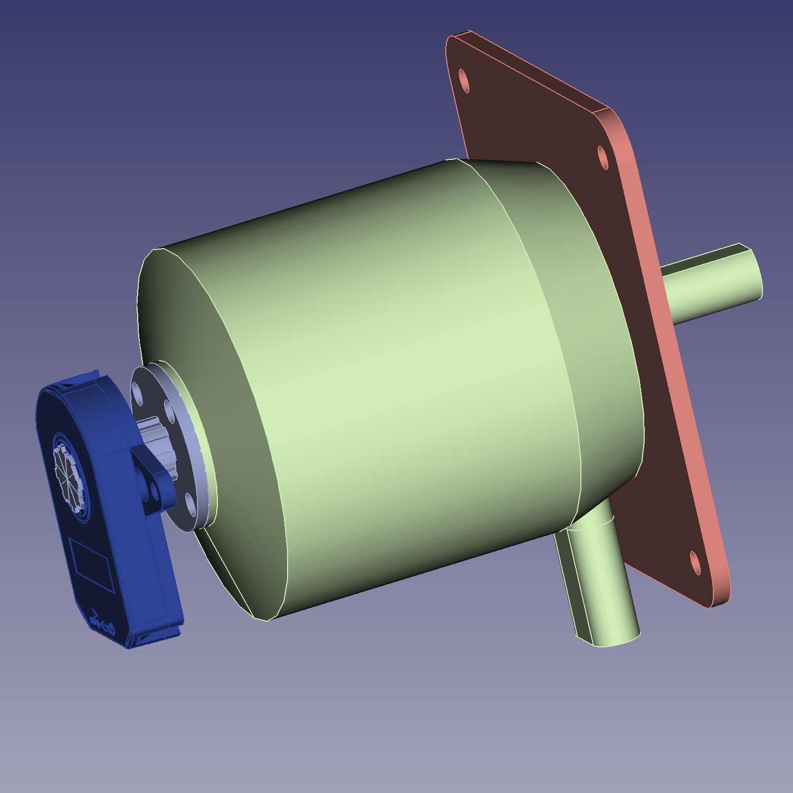
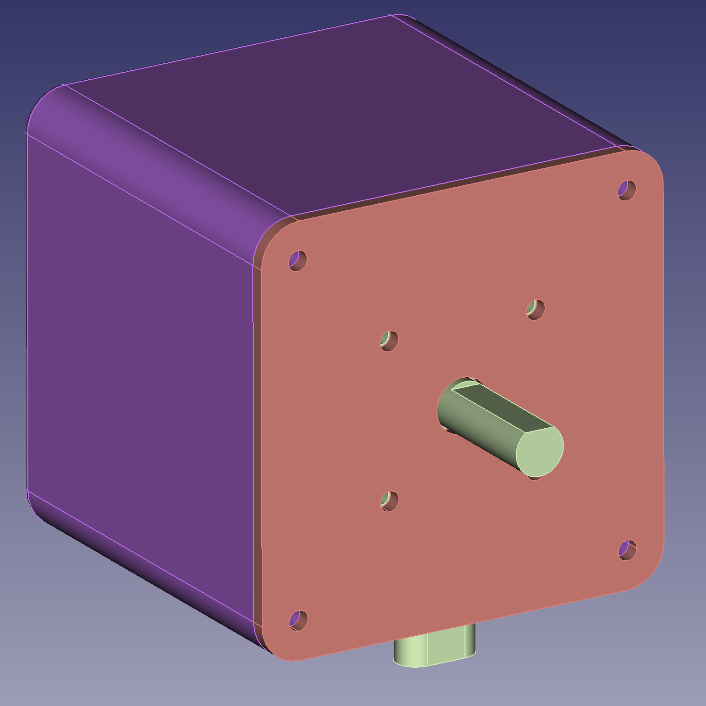
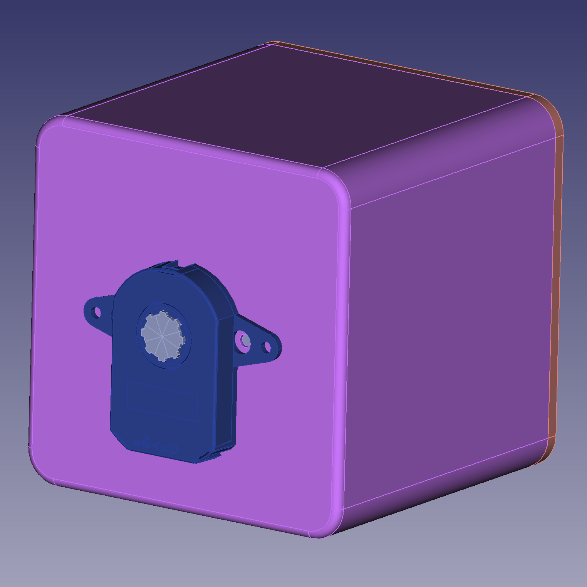

# NemaBLDC

# Goal

Provide a Nema34 compatible case for C6374 170KV BLDC Motor with CUI AMT V102 encoder to be used as a powerful servo with [odrive](https://odriverobotics.com/).

# Pictures 

# Print

All parts were printed on [Prusa MK3S](https://www.prusa3d.com/) out of PETG with 0.15mm layer height PrusaSlicer-2.2.0 default-QUALITY setting, 0.4mm nozzle and 2 perimeters without supports.
Back and front have 15% gyroid infill.
The encoder shaft has 100% rectolinear infill.
CAD were designed in freecad version 0.19 with Assembly 4 addon.

# Build

1. Clean the M4 nut slots as overhanging arches tend to produce a small amount of blocking material.
2. Insert M3 nuts and use tape or glue to hold them in place. 
3. Insert M4 nuts and use tape or glue to hold them in place.
4. Attach encoder mount, usually no need for using the mounting tool delivered with the encoder
5. Attach encoder and encoder cable
6. Attach encoder shaft to motor with 2 M4 screws
7. Attach motor to front plate with 4 M4 screws
8. Carefully insert motor into case, having the teeth of the encoder shaft visible to avoid damaging the shaft or the encoder.
9. Close the case with 4 M4 screws from the front.

# BOM

|Count |Part  | Comment
--- | --- | ---
|2|M3 nut|for the encoder mount
|2|M3 5mm screw|for the encoder mount
|4|M4 nut|
|10|M4 10mm screw|for motor and encoder shaft mounting and keeping the front on the box
|1|[AMT102-V](https://octopart.com/amt102-v-cui+devices-106233269)|
|1|[AMT102-V cable](https://octopart.com/search?q=CUI-3132-1FT&currency=USD&specs=0)|
|some|PETG filament|
